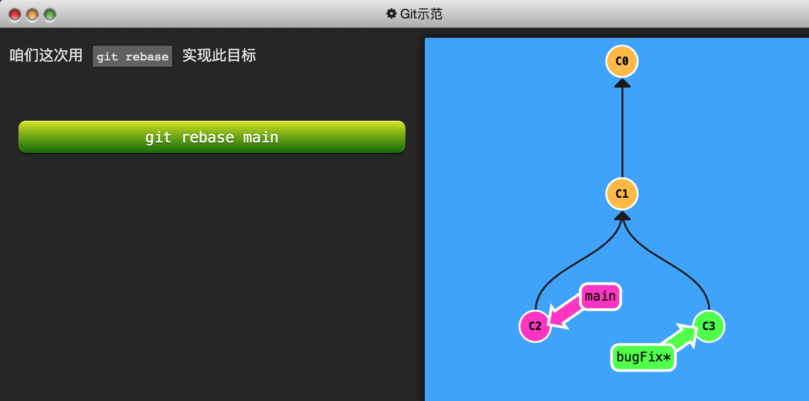
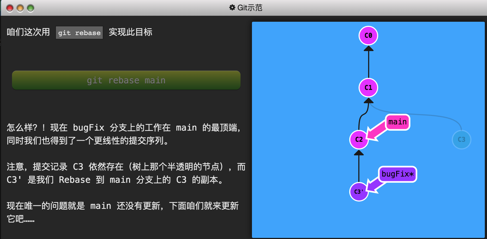
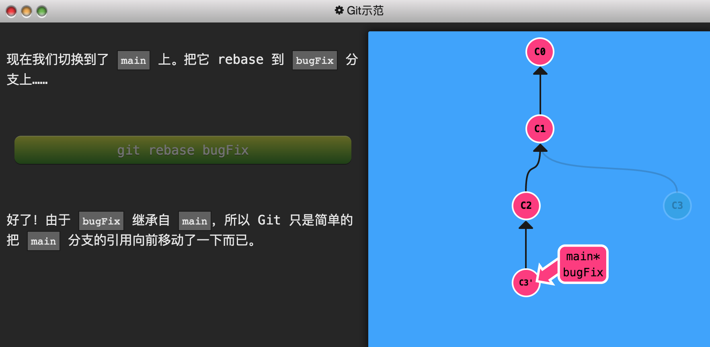
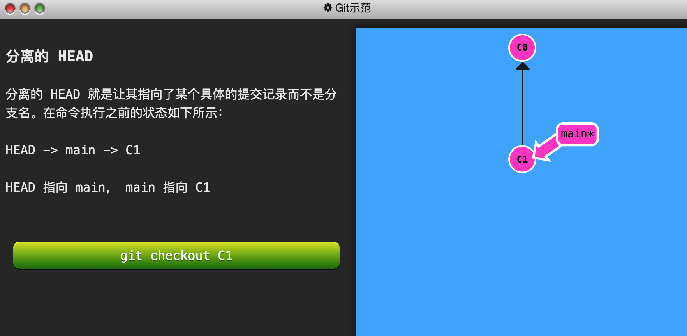
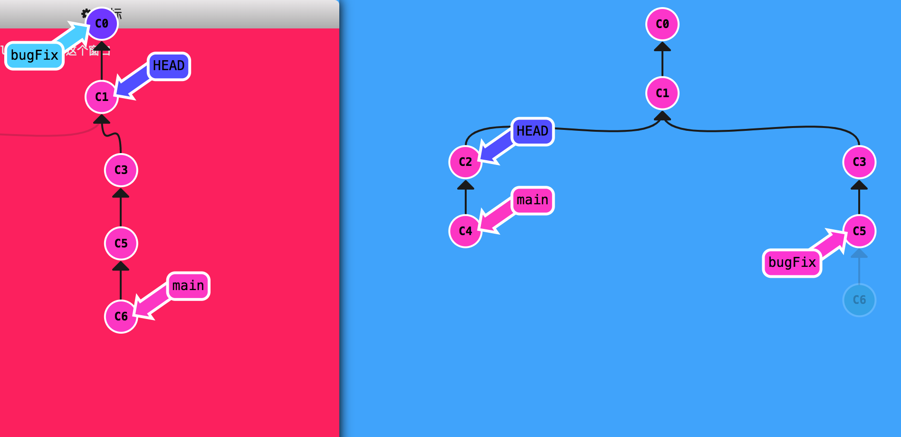

git commit 是快照

## 新建分支并切换
git branch bugfix
git checkout bugfix

或者 git checkout -b bugfix

## 分支合并

### merge
main *
git branch bugFix
git checkout bugFix
git commit
git checkout main
git commit 
git merge bugFix

### rebase
第二种合并分支的方法是 git rebase。Rebase 实际上就是取出一系列的提交记录，“复制”它们，然后在另外一个地方逐个的放下去。

Rebase 的优势就是可以创造更线性的提交历史，这听上去有些难以理解。如果只允许使用 Rebase 的话，代码库的提交历史将会变得异常清晰。

在bugfix分支上
=>

main还没有更新
切换到main分支
=>

git checkout -b bugFix
git commit
git checkout main
git commit
git checkout bugFix
git rebase main

## 在提交树上移动
HEAD
我们首先看一下 “HEAD”。 HEAD 是一个对当前检出记录的符号引用 —— 也就是指向你正在其基础上进行工作的提交记录。

HEAD 总是指向当前分支上最近一次提交记录。大多数修改提交树的 Git 命令都是从改变 HEAD 的指向开始的。

HEAD 通常情况下是指向分支名的（如 bugFix）。在你提交时，改变了 bugFix 的状态，这一变化通过 HEAD 变得可见。

### 通过哈希值指定提交记录

git checkout C4
HEAD 指向 C4

通过指定提交记录哈希值的方式在 Git 中移动不太方便。
实际应用时，并没有像本程序中这么漂亮的可视化提交树供你参考，所以你就不得不用 **git log 来查查看提交记录的哈希值**。

且哈希值在真实的 Git 世界中也会更长（译者注：基于 SHA-1，共 40 位）。例如前一关的介绍中的提交记录的哈希值可能是 fed2da64c0efc5293610bdd892f82a58e8cbc5d8。舌头都快打结了吧...

比较令人欣慰的是，Git 对哈希的处理很智能。你只需要提供能够唯一标识提交记录的前几个字符即可。因此我可以仅输入fed2 而不是上面的一长串字符。

### 相对引用

如我前面所说，通过哈希值指定提交记录很不方便，所以 Git 引入了相对引用。这个就很厉害了!

使用相对引用的话，你就可以从一个易于记忆的地方（比如 bugFix 分支或 HEAD）开始计算。

相对引用非常给力，这里我介绍两个简单的用法：

使用 ^ 向上移动 1 个提交记录
使用 ~<num> 向上移动多个提交记录，如 ~3

首先看看操作符 (^)。把这个符号加在引用名称的后面，表示让 Git 寻找指定提交记录的父提交。

所以 main^ 相当于“main 的父节点”。

main^^ 是 main 的第二个父节点

现在咱们切换到 main 的父节点
git checkout main^

你也可以将 HEAD 作为相对引用的参照。下面咱们就用 HEAD 在提交树中向上移动几次。
git checkout C3
git checkout HEAD^
git checkout HEAD^
git checkout HEAD^

“~”操作符
如果你想在提交树中向上移动很多步的话，敲那么多 ^ 貌似也挺烦人的，Git 当然也考虑到了这一点，于是又引入了操作符 ~。

该操作符后面可以跟一个数字（可选，不跟数字时与 ^ 相同，向上移动一次），指定向上移动多少次。咱们还是通过实际操作看一下吧

咱们用 ~<num> 一次后退四步。
git checkout HEAD~4

强制修改分支位置：
你现在是相对引用的专家了，现在用它来做点实际事情。

我使用相对引用最多的就是移动分支。可以直接使用 -f 选项让分支指向另一个提交。例如:
git branch -f main HEAD~3
上面的命令会将 main 分支强制指向 HEAD 的第 3 级父提交。

相对引用为我们提供了一种简洁的引用提交记录 C1 的方式， 而 -f 则容许我们将分支强制移动到那个位置。

例题：

git branch -f main C6
git checkout HEAD^
git branch -f bugFix HEAD^

## 撤销变更

在 Git 里撤销变更的方法很多。和提交一样，撤销变更由底层部分（暂存区的独立文件或者片段）和上层部分（变更到底是通过哪种方式被撤销的）组成。我们这个应用主要关注的是后者。

主要有两种方法用来撤销变更 —— 一是 git reset，还有就是 git revert。接下来咱们逐个进行讲解。

git reset HEAD~1

git revert HEAD  变更远端

## cherry-pick

git cherry-pick c1 c2

## 交互式的rebase

