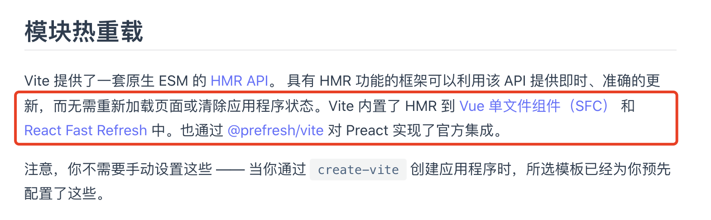

### vite实现原理与webpack实现原理，vite的优势

#### 深入了解webpack HMR实现原理 =》
https://juejin.cn/post/6844904020528594957#heading-42    很详细
https://zhuanlan.zhihu.com/p/30669007

#### 对比esbuild方式原理是否一致 =》 
zw vue-cli 详解 波比课程介绍esbuild方式的冷启动和热更新
vite官网介绍

#### 比较vite与webpack的区别 =》
vite官网已基本阐明，自己根据webpack打包构建过程原理比较即可总结出来

完全掌握vite原理及优势
扒源码，自己撸一个可以启动使用的vite，看issue，看老版本代码是核心代码，这样可以精通

