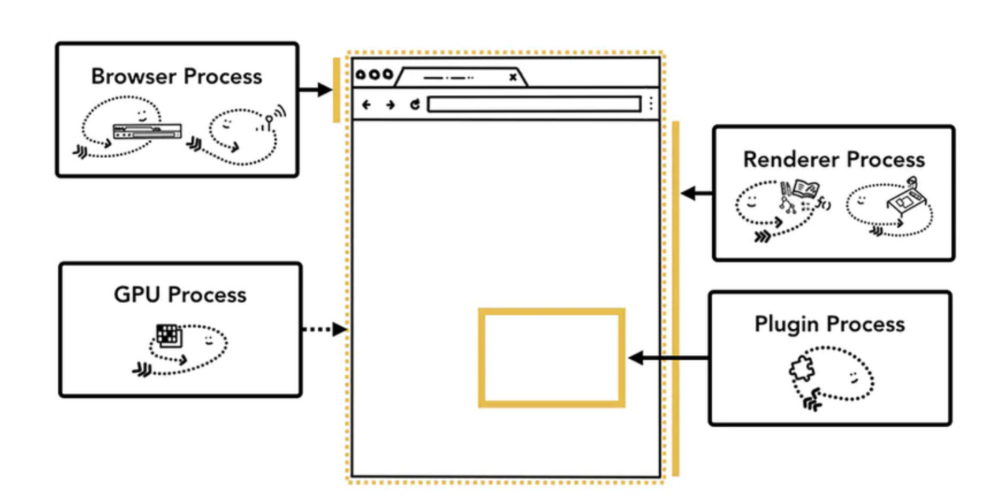

# 你不知道的浏览器渲染原理（图文并茂，8000字深度解读）

在我们面试过程中，面试官经常会问到这么一个问题，那就是从在浏览器地址栏中输入URL到页面显示，浏览器到底发生了什么？
这个问题看起来是老生常谈，但是这个问题回答的好坏，确实可以很好的反映出面试者知识的**广度和深度**。

本文从浏览器角度来告诉你，URL后输入后按回车，浏览器内部究竟发生了什么，读完本文后，你将了解到：

1.浏览器内有哪些进程，这些进程都有些什么作用?

2.浏览器地址输入URL后，内部的进程、线程都做了哪些事?

3.我们与浏览器交互时，内部进程是怎么处理这些交互事件的?

## 浏览器架构

在讲浏览器架构之前，先理解两个概念，**进程**和**线程**。

进程（process）是程序的一次执行过程，是一个动态概念，是程序在执行过程中分配和管理资源的基本单位，线程（thread）是CPU调度和分派的基本单位，它可与同属一个进程的其他的线程**共享进程所拥有的全部资源**。

简单的说呢，进程可以理解成正在执行的应用程序，而线程呢，可以理解成我们应用程序中的代码的执行器。而他们的关系可想而知，线程是跑在进程里面的，一个进程里面可能有一个或者多个线程，而一个线程，只能隶属于一个进程。

大家都知道，浏览器属于一个应用程序，而应用程序的一次执行，可以理解为计算机启动了一个进程，进程启动后，**CPU会给该进程分配相应的内存空间**，当我们的进程得到了内存之后，就可以使用线程进行资源调度，进而完成我们应用程序的功能。

而在应用程序中，为了满足功能的需要，启动的进程会创建另外的新的进程来处理其他任务，这些创建出来的新的进程**拥有全新的独立的内存空间**，不能与原来的进程共享内存，如果这些进程之间需要通信，可以通过**IPC机制（Inter Process Communication）**来进行。

很多应用程序都会采取这种多进程的方式来工作，因为进程和进程之间是互相独立的它们互不影响，也就是说，当其中一个进程挂掉了之后，不会影响到其他进程的执行，只需要重启挂掉的进程就可以恢复运行。

### 浏览器的多进程架构

假如我们去开发一个浏览器，它的架构可以是一个单进程多线程的应用程序，也可以是一个使用IPC通信的多进程应用程序。

不同的浏览器使用不同的架构，下面主要以Chrome为例，介绍浏览器的多进程架构。

**在Chrome中，主要的进程有4个：**

浏览器进程 (Browser Process)：负责浏览器的TAB的前进、后退、地址栏、书签栏的工作和处理浏览器的一些不可见的底层操作，比如网络请求和文件访问。

渲染进程 (Renderer Process)：负责一个Tab内的显示相关的工作，也称渲染引擎。

插件进程 (Plugin Process)：负责控制网页使用到的插件

GPU进程 (GPU Process)：负责处理整个应用程序的GPU任务

**这4个进程之间的关系是什么呢？**

首先，当我们是要浏览一个网页，我们会在浏览器的地址栏里输入URL，
这个时候Browser Process会向这个URL发送请求，获取这个URL的HTML内容，然后将HTML交给Renderer Process，
Renderer Process解析HTML内容，解析遇到需要请求网络的资源又返回来交给Browser Process进行加载，
同时通知Browser Process，需要Plugin Process**加载插件资源，执行插件代码**。
解析完成后，Renderer Process**计算得到图像帧**，并将这些**图像帧交给GPU Process**，GPU Process将其**转化为图像显示屏幕**。

### 多进程架构的好处

Chrome为什么要使用多进程架构呢？

第一，更高的容错性。
当今WEB应用中，HTML，JavaScript和CSS日益复杂，这些跑在渲染引擎的代码，频繁的出现BUG，而有些BUG会直接导致渲染引擎崩溃，多进程架构使得每一个渲染引擎运行在各自的进程中，相互之间不受影响，也就是说，当其中一个页面崩溃挂掉之后，其他页面还可以正常的运行不收影响。

第二，更高的安全性和沙盒性（sanboxing）。
渲染引擎会经常性的在网络上遇到不可信、甚至是恶意的代码，它们会利用这些漏洞在你的电脑上安装恶意的软件，针对这一问题，浏览器对不同进程限制了不同的权限，并为其提供沙盒运行环境，使其更安全更可靠

第三，更高的响应速度。在单进程的架构中，各个任务相互竞争抢夺CPU资源，使得浏览器响应速度变慢，而多进程架构正好规避了这一缺点。

### 多进程架构优化

之前的我们说到，Renderer Process的作用是负责一个Tab内的显示相关的工作，这就意味着，一个Tab，就会有一个Renderer Process，这些进程之间的内存无法进行共享，而不同进程的内存常常需要包含相同的内容。

#### 浏览器的进程模式
为了节省内存，Chrome提供了四种进程模式（Process Models），不同的进程模式会对 tab 进程做不同的处理。

Process-per-site-instance (default) - 同一个 site-instance 使用一个进程

Process-per-site - 同一个 site 使用一个进程

Process-per-tab - 每个 tab 使用一个进程

Single process - 所有 tab 共用一个进程

这里需要给出 site 和 site-instance 的定义

**site** 指的是相同的 registered domain name(如：google.com ，bbc.co.uk)和scheme (如：https://)。比如a.baidu.com和b.baidu.com就可以理解为同一个 site（注意这里要和 Same-origin policy 区分开来，同源策略还涉及到子域名和端口）。

**site-instance** 指的是一组 connected pages from the same site，这里 connected 的定义是 can obtain references to each other in script code 怎么理解这段话呢。满足下面两中情况并且打开的新页面和旧页面属于上面定义的同一个 site，就属于同一个 site-instance

用户通过<a target="_blank">这种方式点击打开的新页面

JS代码打开的新页面（比如 window.open)

理解了概念之后，下面解释四个进程模式

首先是Single process，顾名思义，单进程模式，所有tab都会使用同一个进程。接下来是Process-per-tab ，也是顾名思义，每打开一个tab，会新建一个进程。而对于Process-per-site，当你打开 a.baidu.com 页面，在打开 b.baidu.com 的页面，这两个页面的tab使用的是共一个进程，因为这两个页面的site相同，而如此一来，如果其中一个tab崩溃了，而另一个tab也会崩溃。

Process-per-site-instance 是最重要的，因为这个是 Chrome 默认使用的模式，也就是几乎所有的用户都在用的模式。当你打开一个 tab 访问 a.baidu.com ，然后再打开一个 tab 访问 b.baidu.com，这两个 tab 会使用两个进程。而如果你在 a.baidu.com 中，通过JS代码打开了 b.baidu.com 页面，这两个 tab 会使用同一个进程。

**默认模式选择**
那么为什么浏览器使用Process-per-site-instance作为默认的进程模式呢？

Process-per-site-instance兼容了性能与易用性，是一个比较中庸通用的模式。

相较于 Process-per-tab，能够少开很多进程，就意味着更少的内存占用

相较于 Process-per-site，能够更好的隔离相同域名下毫无关联的 tab，更加安全

## 导航过程都发生了什么

前面我们讲了浏览器的多进程架构，讲了多进程架构的各种好处，和Chrome是怎么优化多进程架构的，下面从用户浏览网页这一简单的场景，来**深入了解进程和线程是如何呈现我们的网站页面的**。

### 网页加载过程

