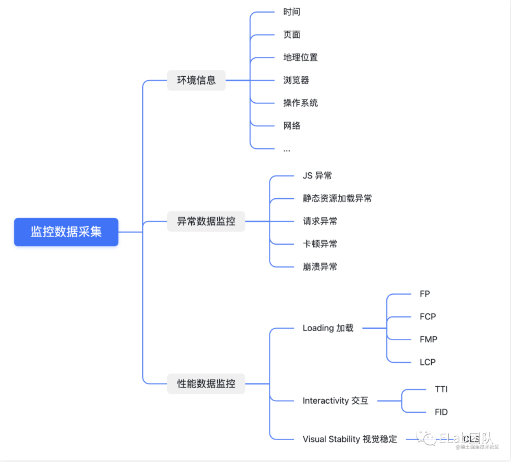

[深入浅出前端监控](https://mp.weixin.qq.com/s/0zpEIECoWGixJ6E3Rjq5eQ?st=2A4C17F384FA7A013A1AD5B991742D8617DDC4FF554E7BAB04C017875380600F979DFAA45A25D320B8EADE94A77FE177131E95176264B97625C459EF5F6B1F0B748AD2E9A2930200FA269BC6108F55549C6ED8B1A493FABF4F529C5ACF6E42CCE068292AC2F73B8960D8B8DFF9E078759C31485A9EE5A18D6234A35E1C37081611719C955C00AF77928A561E21C1A5113FD2C96D2F5DC20450F6CA6D555CAD340A8A0667A95A1D69E98807789592ECB3495E05027953180CA1A5161949B33C36E935D1C9A355BC171B94DE4016C3F7C8&vid=1688850504763890&cst=5723224FDB3A7412D40F0CD547CBF5E0210AC87000A814247BBC0BE55DCA2A0A13079DEE4A6B3BD9791B470490FCEEF3&deviceid=70effc19-4a72-4055-bd41-c9c095d3fd8e&version=4.0.2.90460&platform=mac)

前端环境下监控数据从大的维度上可划分成**环境信息**、**异常数据**和**性能数据**



# 环境信息

采集的监控数据一般都会设置一些通用的环境信息，这些环境信息可以提供更多的维度以帮助用户发现问题和解决问题。
下面列举了一些常见的环境信息：

页面地址
时间
地理位置
浏览器
操作系统
网络
用户标识

# 异常监控


unhandledrejection

捕获成功，但是仍然默认有报错提示，使用如下手段进行阻止默认行为
```js
window.addEventListener("unhandledrejection", event => {
  console.warn(`UNHANDLED PROMISE REJECTION: ${event.reason}`);
  event.preventDefault()
  // 通过addEventListener绑定的事件，不能通过return false来阻止默认行为
});

window.onunhandledrejection = event => {
  console.warn(`UNHANDLED PROMISE REJECTION: ${event.reason}`);
  event.preventDefault()
  // 或 return false
};

```

sourceMap

[深入浅出之 Source Map](https://juejin.cn/post/7023537118454480904)


