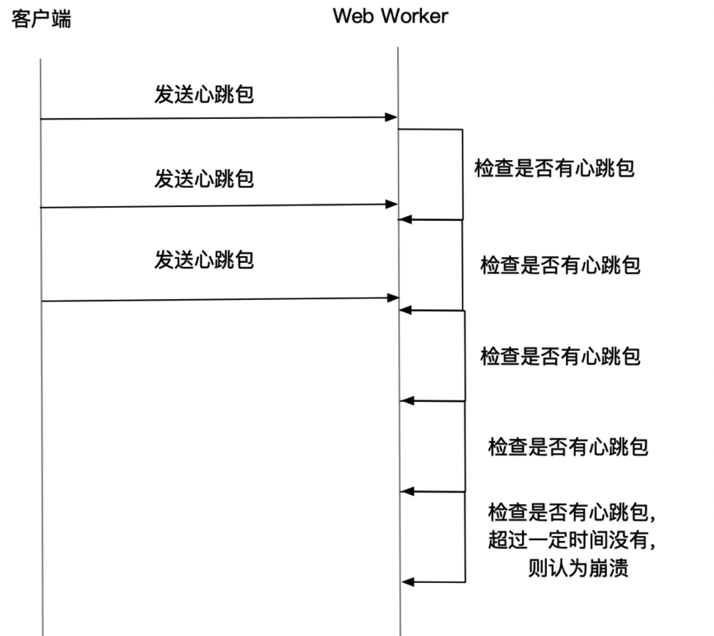

# 崩溃异常

Web 页面崩溃指在网页运行过程页面完全无响应的现象，通常有两种情况会造成页面崩溃：

1.JS 主线程出现无限循环，触发浏览器的保护策略，结束当前页面的进程。
2.内存不足

发生**崩溃时主线程被阻塞**，因此对崩溃的监控只能在独立于 JS 主线程的 Worker 线程中进行，
我们可以采用 Web Worker 心跳检测的方式来对主线程进行不断的探测，
如果主线程崩溃，就不会有任何响应，那就可以在 Worker 线程中进行崩溃异常的上报。
这里继续贴一下 Slardar 的检测策略：

1.JS 主线程：

固定时间间隔（2s）向 Web Worker 发送心跳

2.Web Worker:

定期（2s）检查是否收到心跳。
超过一定时间（6s）未收到心跳，则认为页面崩溃。
检测到崩溃后，通过 http 请求进行异常上报。

