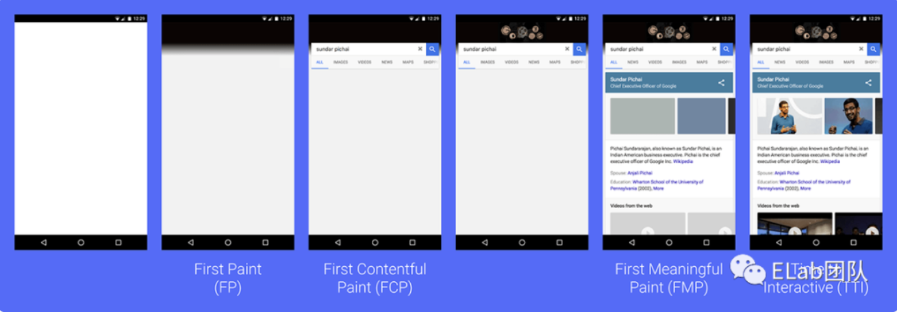
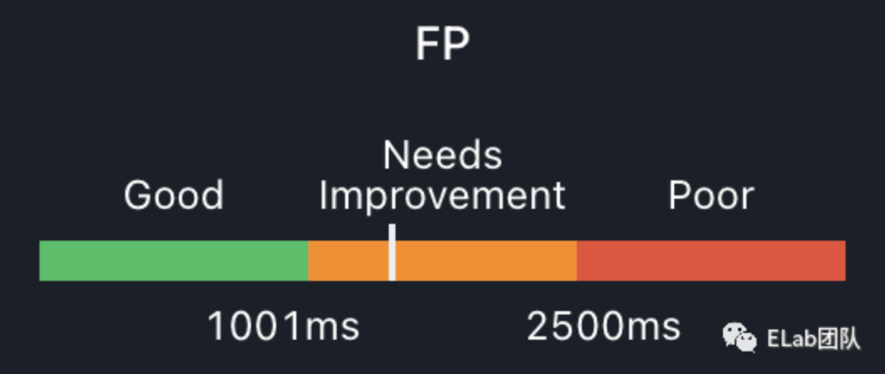
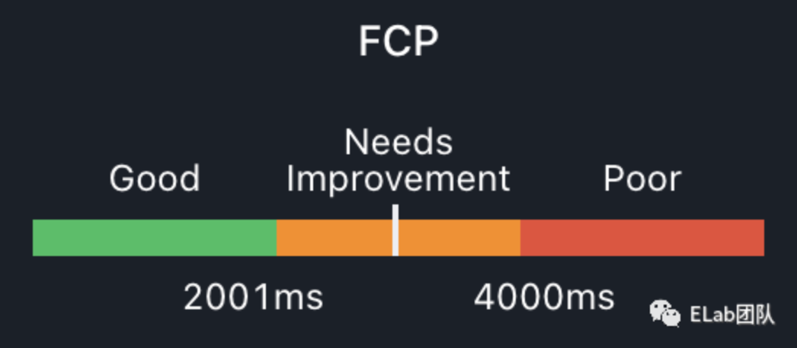
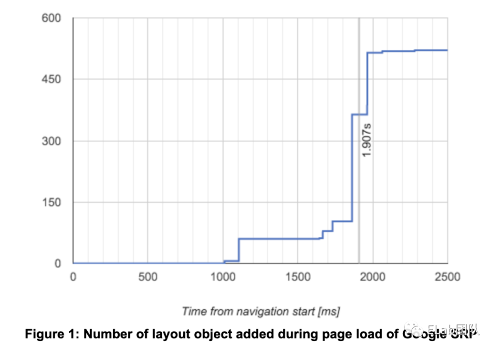
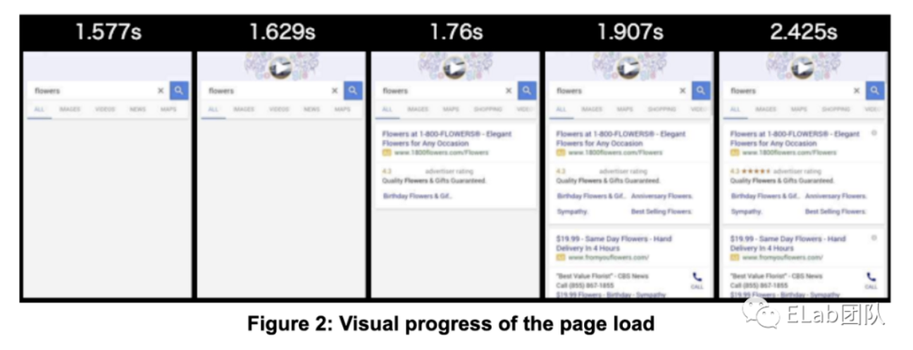
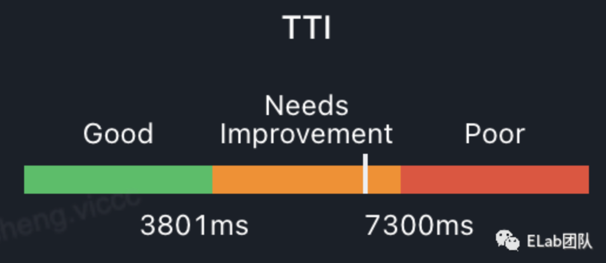
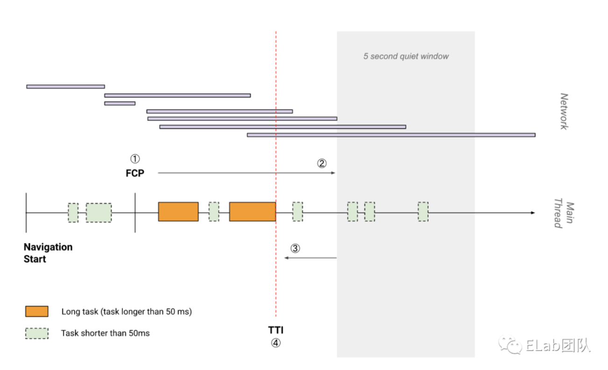
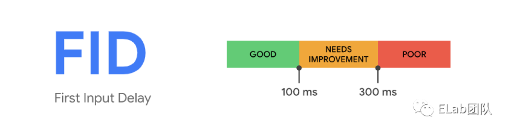
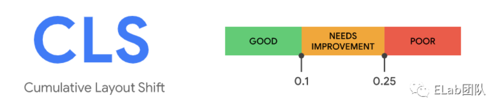
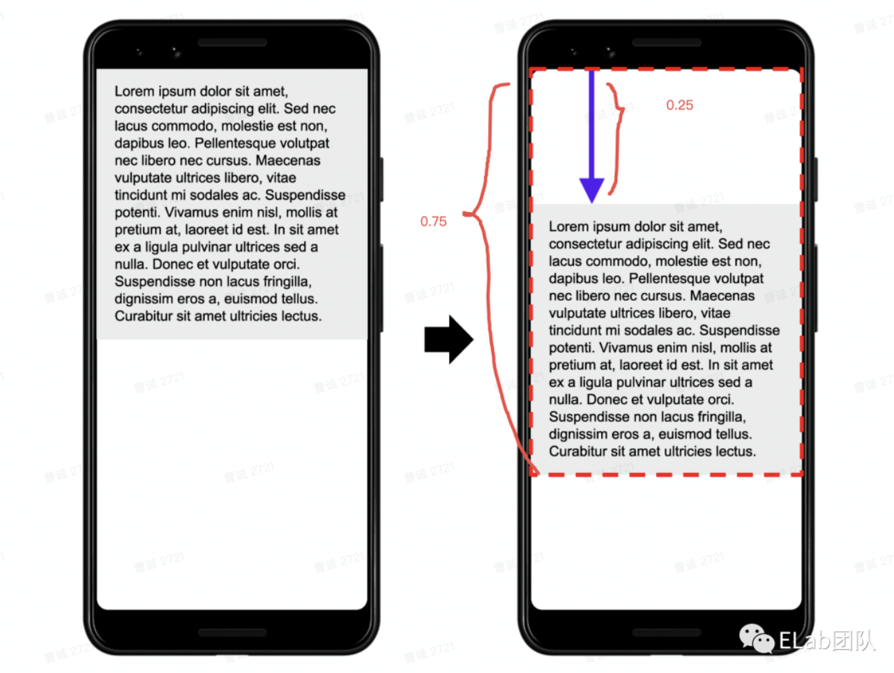

开源样例
https://segmentfault.com/a/1190000039023963
=>
https://github.com/KieSun/per-moniteur
# 性能监控

性能监控并不只是简单的监控“页面速度有多快”，需要从用户体验的角度全面衡量性能指标。（就是所谓的 RUM 指标）
目前业界主流标准是 Google 最新定义的 Core Web Vitals：

1.加载（loading） ：LCP
2.交互（interactivity） ：FID
3.视觉稳定（visual stability） ：CLS

可以看到最新标准中，**以往熟知的 FP、FCP、FMP、TTI 等指标都被移除了**，个人认为这些指标还是具备一定的参考价值，因此下文还是会将这些指标进行相关介绍。（谷歌的话不听不听🙉）

## Loading 加载

和 Loading 相关的指标有 FP 、FCP 、FMP 和 LCP，首先来看一下我们相对熟悉的几个指标：

FP/FCP/FMP



### FP (First Paint): 
当前页面首次渲染的时间点，通常将开始访问 Web 页面的时间点到 FP 的时间点的这段时间视为白屏时间，简单来说就是有屏幕中像素点开始渲染的时刻即为 FP。



### FCP ( First Contentful Paint ): 
当前页面首次有内容渲染的时间点，这里的 内容 通常指的是文本、图片、svg 或 canvas 元素。



这两个指标都通过 PerformancePaintTiming API 获取：

通过 PerformancePaintTiming 获取 FP 和 FCP

```js
function getPaintTimings() {
  let performance = window.performance;
  if (performance) {
    let paintEntries = performance.getEntriesByType('paint');
    console.log(paintEntries);
    return {
      FP: paintEntries.filter((entry) => entry.name === 'first-paint')[0].startTime,
      FCP: paintEntries.filter((entry) => entry.name === 'first-contentful-paint')[0].startTime,
    }
  }
}

```

### 下面再来看 FMP 的定义和获取方式：

FMP (First Meaningful Paint): 表示首次绘制有意义内容的时间，在这个时刻，页面整体布局和文字内容全部渲染完成，用户能够看到页面主要内容，产品通常也会关注该指标。

FMP 的计算相对复杂，因为浏览器并未提供相应的 API，在此之前我们先看一组图：





从图中可以发现页面渲染过程中的一些规律：

在 1.577 秒，页面渲染了一个搜索框，此时已经有 60 个布局对象被添加到了布局树中。
在 1.760 秒，页面头部整体渲染完成，此时布局对象总数是 103 个。
在 1.907 秒，页面主体内容已经绘制完成，此时有 261 个布局对象被添加到布局树中从用户体验的角度看，**此时的时间点就是是 FMP**。

可以看到布局对象的数量与页面完成度高度相关。
业界目前比较认可的一个计算 FMP 的方式就是——「页面在加载和渲染过程中**最大布局变动之后**的那个绘制时间**即为当前页面的 FMP** 」

实现原理则需要通过 MutationObserver 监听 document 整体的 DOM 变化，在回调计算出当前 DOM 树的分数，分数变化最剧烈的时刻，即为 FMP 的时间点。

至于如何计算当前页面 DOM 🌲的分数，LightHouse 的源码中会根据当前节点深度作为变量做一个权重的计算，具体实现可以参考 LightHouse 源码。
```js
const curNodeScore = 1 + 0.5 * depth;
const domScore = 所有子节点分数求和
```
上述计算方式性能开销大且未必准确，**LightHouse 6.0 已明确废弃了 FMP 打分项**，建议在具体业务场景中根据实际情况**手动埋点来确定 FMP 具体的值**，更准确也更高效。

### LCP


没错，LCP (Largest Contentful Paint) 是就是用来代替 FMP 的一个性能指标 ，用于度量视口中最大的内容元素何时可见，可以用来确定页面的主要内容何时在屏幕上完成渲染。

使用 Largest Contentful Paint API 和 PerformanceObserver 即可获取 LCP 指标的值：

===
PerformanceObserver 接口用于观察性能评估事件，并在浏览器的性能时间表中记录新的性能指标时通知它们。此特性在 Web Worker 中可用。
```js
function perf_observer(list, observer) { 
   // 处理 “measure” 事件
} 
var observer2 = new PerformanceObserver(perf_observer); 
observer2.observe({entryTypes: ["measure"]});
```
===

获取 LCP

```js
const observer = new PerformanceObserver((entryList) => {
  for (const entry of entryList.getEntries()) {
    console.log('LCP candidate', entry.startTime, entry);
  }
})
observer.observe({type: 'largest-contentful-paint', buffered: true});
```

## Interactivity 交互

### TTI



TTI(Time To Interactive) 表示从页面加载开始到页面处于完全可交互状态所花费的时间， TTI 值越小，代表用户可以更早地操作页面，用户体验就更好。

这里定义一下什么是完全可交互状态的页面：

页面已经显示有用内容。
页面上的可见元素关联的事件响应函数已经完成注册。
事件响应函数可以在事件发生后的 50ms 内开始执行（主线程无 Long Task）。

TTI 的算法略有些复杂，结合下图看一下具体步骤：


Long Task: 阻塞主线程达 50 毫秒或以上的任务。

1.从 FCP 时间开始，向前搜索一个不小于 5s 的静默窗口期。（静默窗口期定义：窗口所对应的时间内没有 Long Task，且进行中的网络请求数不超过 2 个）

2.找到静默窗口期后，从静默窗口期向后搜索到最近的一个 Long Task，Long Task 的结束时间即为 TTI。

3.如果一直找到 FCP 时刻仍然没有找到 Long Task，以 FCP 时间作为 TTI。

其实现需要支持 Long Tasks API 和 Resource Timing API，具体实现感兴趣的同学可以按照上述流程尝试手动实现。

(计算方式
谷歌提供了ttiPolyfill的sdk来计算,实际上是计算long tas，它把onload为起点，以5秒作为一个时间窗口，找到一个没有long task并且没有两个以上未完全的请求的时间窗口来上报tti。
我们也可以像计算fmp一样的方法来计算tti，在可交互的元素渲染后打点，虽然需要手动打点，但比较可靠。)


### FID


FID(First Input Delay) 用于度量用户第一次与页面交互的延迟时间，是用户第一次与页面交互到浏览器真正能够开始处理事件处理程序以响应该交互的时间。

其实现使用简洁的 PerformanceEventTiming API 即可，回调的触发时机是用户首次与页面发生交互并得到浏览器响应（点击链接、输入文字等）。

获取 FID
```js

const onFirstInputEntry = (entry) => {
  const fid = entry.processingStart - entry.startTime;
  console.log(fid);
  //report({fid});
}

const observer = new PerformanceObserver((entryList) => {
  entryList.getEntries().forEach(onFirstInputEntry)
})
observer.observe({type: 'first-input', buffered: true});

```

至于为何新的标准中采用 FID 而非 TTI，可能存在以下几个因素：

1.FID 是需要用户实际参与页面交互的，只有用户进行了交互动作才会上报 FID，TTI 不需要。
2.FID 反映用户对页面交互性和响应性的第一印象，良好的第一印象有助于用户建立对整个应用的良好印象。

## Visual Stability 视觉稳定

### CLS



CLS(Cumulative Layout Shift) 是对在页面的整个生命周期中发生的每一次意外布局变化的最大布局变化得分的度量，布局变化得分越小证明你的页面越稳定。

听起来有点复杂，这里做一个简单的解释：

1.不稳定元素：一个非用户操作但发生较大偏移的可见元素称为不稳定元素。
2.布局变化得分：元素从原始位置偏移到当前位置影响的页面比例 * 元素偏移距离比例

举个例子，一个占据页面高度 50% 的元素，向下偏移了 25%，那么其得分为 0.75 * 0.25，大于标准定义的 0.1 分，该页面就视为视觉上没那么稳定的页面。



使用 Layout Instability API 和 PerformanceObserver 来获取 CLS：

获取 CLS

```js
let clsValue = 0;
let clsEntries = [];
let sessionValue = 0;
let sessionEntries = [];
new PerformanceObserver((entryList) => {
  for (const entry of entryList.getEntries()) {
    if (!entry.hadRecentInput) {
      const firstSessionEntry = sessionEntries[0];
      const lastSessionEntry = sessionEntries[sessionEntries.length - 1];
      if (sessionValue
          && entry.startTime - lastSessionEntry.startTime < 1000
          && entry.startTime - firstSessionEntry.startTime < 5000) {
        sessionValue += entry.value;
        sessionEntries.push(entry);
      } else {
        sessionValue = entry.value;
        sessionEntries = [entry];
      }
      if (sessionValue > clsValue) {
        clsValue = sessionValue;
        clsEntries = sessionEntries;
        console.log('CLS:', clsValue, clsEntries);
      }
    }
  }
}).observe({ type: 'layout-shift', buffered: true });
```

一点感受：在翻阅诸多参考资料后，私以为性能监控是一件长期实践、以实际业务为导向的事情，业内主流标准日新月异，到底监控什么指标是最贴合用户体验的我们不得而知，对于 FMP、FPS 这类浏览器未提供 API 获取方式的指标花费大量力气去探索实现是否有足够的收益也存在一定的疑问，但毋容置疑的是从自身页面的业务属性出发，结合一些用户反馈再进行相关手段的优化可能是更好的选择。（更推荐深入了解浏览器渲染原理，写出性能极佳的页面，让 APM 同学失业

# 数据上报

得到所有错误、性能、用户行为以及相应的环境信息后就要考虑如何进行数据上报，理论上正常使用ajax 即可，但有一些数据上报可能出现在页面关闭 (unload) 的时刻，这些请求会被浏览器的策略 cancel 掉，因此出现了以下几种解决方案：

1.优先使用 Navigator.sendBeacon，这个 API 就是为了解决上述问题而诞生，它通过 HTTP POST 将数据异步传输到服务器且不会影响页面卸载。

2.如果不支持上述 API，动态创建一个  标签将数据通过 url 拼接的方式传递。

3.使用同步 XHR 进行上报以延迟页面卸载，不过现在很多浏览器禁止了该行为。

（Slardar 采取了第一种方式，不支持 sendBeacon 则使用 XHR，偶尔丢日志的原因找到了。）

由于监控数据通常量级都十分庞大，因此不能简单地采集一个就上报一个，需要一些优化手段：

1.请求聚合：将多条数据聚合一次性上报可以减少请求数量，例如我们打开任意一个已接入 Slardar 的页面查看 batch 请求的请求体：

2.设置采样率： 像崩溃、异常这类数据不出意外都是设置 100% 的采样率，对于自定义日志可以设置一个采样率来减少请求数量，大致实现思路如下：
```js
// sampleRate 0~1
Report.send = function (data, sampleRate) {
  // 采样率
  if (Math.random() < sampleRate) {
    return send(data) // 上报错误信息
  }
}
```

# 总结
本文旨在提供一个相对体系的前端监控视图，帮助各位了解前端监控领域我们能做什么、需要做什么。此外，如果能对页面性能和异常处理有着更深入的认知，无论是在开发应用时的自我管理（减少 bug、有意识地书写高性能代码），还是自研监控 SDK 都有所裨益。

如何设计监控 SDK 不是本文的重点，部分监控指标的定义和实现细节也可能存在其他解法，实现一个完善且健壮的前端监控 SDK 还有很多技术细节，例如每个指标可以提供哪些配置项、如何设计上报的维度、如何做好兼容性等等，这些都需要在真实的业务场景中不断打磨和优化才能趋于成熟。